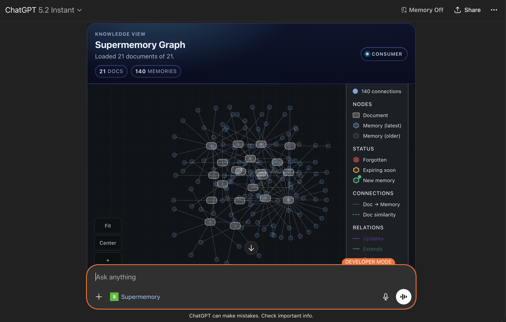

# Supermemory MCP

> Built with Codex. Review, test, and harden before using in production.

MCP server for rendering your Supermemory data as an interactive memory graph inside MCP-compatible clients (Claude, Inspector, and other MCP Apps hosts).

## Demo Preview



## What This Server Does

- Exposes a tool: `show-memory-graph`
- Fetches document data from Supermemory on the server side
- Returns an interactive widget powered by `@supermemory/memory-graph`
- Keeps your Supermemory API key off the client

## Architecture

- Runtime: `mcp-use` server
- Tool handler: `/index.ts`
- Widget UI: `/resources/memory-graph/widget.tsx`
- Widget props schema: `/resources/memory-graph/types.ts`
- Shared styles: `/resources/styles.css`

## Prerequisites

- Node.js 18+
- npm
- Supermemory API key

## Environment Variables

Required:

```bash
SUPERMEMORY_API_KEY=sm_...
```

Optional:

```bash
# Base URL for MCP server metadata (important in deployed environments)
MCP_URL=https://your-mcp-server.example.com

# Override Supermemory API host if needed
SUPERMEMORY_API_BASE_URL=https://api.supermemory.ai
```

## Local Development

```bash
npm install
npm run dev
```

Open Inspector:

- `http://localhost:3000/inspector`

## Tool Contract

### Tool Name

- `show-memory-graph`

### Inputs

- `page?: number` default `1`
- `limit?: number` default `250` (max `500`)
- `sort?: "createdAt" | "updatedAt"` default `"createdAt"`
- `order?: "asc" | "desc"` default `"desc"`
- `variant?: "console" | "consumer"` default `"consumer"`
- `showSpacesSelector?: boolean` default depends on variant

### Behavior

- Calls `POST /v3/documents/documents` on Supermemory
- Returns widget props (`documents`, `variant`, etc.)
- Returns text output summary for the model
- Handles API errors and surfaces readable error messages in the widget

## Deploy

`mcp-use` deploys source from GitHub, but environment variables are attached to the deployment (not committed to the repo).

```bash
npm run deploy
```

Before deploy:

1. Set `SUPERMEMORY_API_KEY` in the deployment environment
2. Set `MCP_URL` to the final public URL
3. Redeploy/restart after environment changes

### Deploy with environment variables (recommended)

Set env vars at deploy time:

```bash
npm run deploy -- \
  --env SUPERMEMORY_API_KEY=sm_your_key_here \
  --env SUPERMEMORY_API_BASE_URL=https://api.supermemory.ai
```

Or use an env file:

```bash
# .env.production (do not commit this file)
SUPERMEMORY_API_KEY=sm_your_key_here
SUPERMEMORY_API_BASE_URL=https://api.supermemory.ai
```

```bash
npm run deploy -- --env-file .env.production
```

If your deployment already exists, re-running deploy updates code from GitHub and keeps/updates deployment env vars based on your flags/dashboard settings.

## Using with Claude

1. Deploy this MCP server
2. Add the MCP server URL in Claude MCP settings
3. Call the tool: `show-memory-graph`

Important:

- Do not put `SUPERMEMORY_API_KEY` into Claude connector fields
- The key belongs only in the MCP server environment

## Troubleshooting

### `401 Unauthorized` from Supermemory

- Key is invalid, malformed, or from the wrong environment
- Ensure key value does not include `Bearer `
- Restart/redeploy after updating env vars

### Graph header renders but canvas is blank

- Usually caused by malformed/empty memory payloads or sizing
- This project normalizes memory entries and enforces widget viewport height
- Confirm tool response includes non-empty `documents`

### Build command fails with `mcp-use: command not found`

- Dependencies are not installed in the current environment
- Run `npm install` first

## Security Notes

- API key is only used server-side
- Never expose Supermemory credentials in widget/client code
- Review CSP and external domains before production rollout

## Production Checklist

1. Validate input limits and rate controls
2. Add request/response observability and error tracking
3. Add auth and access controls for your MCP endpoint
4. Load test with real document volume
5. Pin dependency versions instead of `latest` where required

## Useful Links

- [mcp-use docs](https://mcp-use.com/docs/typescript/getting-started/quickstart)
- [Supermemory docs index](https://supermemory.ai/docs/llms.txt)
- [MCP Apps overview](https://mcp-use.com/docs/typescript/server/mcp-apps)
